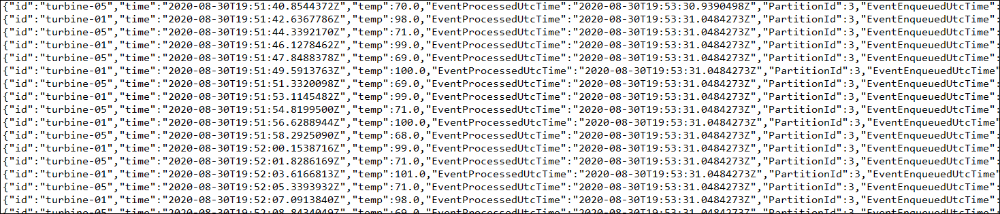

# 練習 2：處理來自 Azure IoT 中樞的資料 

## 案例

Fabrikam, Inc. 的團隊要求所有溫度資料皆可即時取用和分析，還應長期儲存以供歷史分析和資料保留使用。Fabrikam 的管理團隊則要求以即時儀表板與報告的形式存取資料。 

為了達到這些需求，您必須長期儲存發電機裝置產生的所有資料以用於冷路徑分析，以及轉換部分遙測資料以供即時分析使用。此外，您也需要使用 PowerBI 與 TSI 總管，針對熱路徑資料集設定視覺效果。

## 概觀

在此練習中，您會使用串流分析來處理和轉換 IoT 中樞的資料。您會將所有資料儲存在 Blob 儲存體中，以供進行冷路徑分析，並在 PowerBI 中針對熱路徑篩選部分遙測資料，以用於即時分析和視覺效果。

這包括下列各項工作：

* 檢閱串流分析作業
* 開始串流分析作業
* 使用儲存體總管檢閱 Blob 儲存體中的資料
* 在 PowerBI 中視覺化熱路徑資料
* 檢視時間序列深入解析總管

## 解決方案架構
 
         

### 工作 1：開始串流分析作業
**Azure 串流分析**是即時分析與複雜事件處理引擎，專為同時分析和處理來自多個來源的大量快速串流資料而設計。您可以透過下列連結，深入了解 Azure 串流分析：```https://docs.microsoft.com/en-us/azure/stream-analytics/stream-analytics-introduction```

在此工作中，將會執行預先定義的**串流分析作業**來處理和轉換 IoT 中樞的資料。所有資料都會傳送至儲存體帳戶以供長期儲存，以讓 Fabrikam Inc. 能定期加以摘要。您也會將資料傳送至 PowerBI 服務，將「熱」資料視覺化，呈現每部裝置所回報 1 分鐘時間內的平均溫度。 


1. 瀏覽至 Azure 入口網站 (```https://portal.azure.com```)。從資源群組 **iot-{deployment-id}** 中選取串流分析作業名稱 **iot-streamjob-{deployment-id}**。

1. 然後在刀鋒視窗左側的 [作業拓撲] 下，選取 **[輸入]**，然後確認已使用設定為 IoT 中樞的輸入來源，定義一項輸入工作。此輸入可以設定串流分析，處理傳送至 IoT 中樞的各項事件。

   

1. 現在讓我們檢閱一下，為這項串流分析作業設定的輸出資料串流。請選取 [作業拓撲] 下的 **[輸出]**。您會發現已設定 3 個輸出。

 * **Blob 輸出：**在 Azure Blob 儲存體帳戶中儲存處理的資料。此輸出設定為根據日期與時間建立個別的資料夾。
 * **PowerBI 輸出：**與 PowerBI 工作區連線，存取串流分析中的即時資料串流。
 * **服務匯流排輸出：**將資料傳送至服務匯流排命名空間。在下個練習中，服務匯流排輸出會用來設定警示。

1. 由於您是第一次登入，因此必須更新 PowerBI 工作區的授權。  選取 **powerbioutput**，然後按一下 **[更新授權]**。 

   

1. 當系統提示您提供 Azure 認證時，請提供 [環境詳細資料] 索引標籤中的 **[Azure 使用者名稱]** 與 **[密碼]**，然後按一下 **[儲存]**。

    * 電子郵件/使用者名稱：<inject key="AzureAdUserEmail"></inject>
    * 密碼：<inject key="AzureAdUserPassword"></inject>

1. 瀏覽回到 *[串流分析作業]* 的 **[概觀]** 刀鋒視窗，現在可以看到用來傳輸和分析資料的查詢： 

       SELECT * INTO bloboutput FROM iothubinput; 
 
   > **注意**：此查詢會選取 **iothubinput** 中的所有遙測資料，並傳送至 **bloboutput**。對於此基本查詢，我們不必使用 Azure 串流分析作業，而是改用 Azure IoT 中樞本身的**訊息路由**功能，將資料儲存在儲存體帳戶中。在 Azure 串流分析中，能夠處理資料並加以傳輸，如同下個查詢所示範。您可以透過下列連結，深入了解**訊息路由**：```https://docs.microsoft.com/en-us/azure/iot-hub/iot-hub-devguide-messages-d2c``` 

       SELECT AVG(temp) AS Average, id  INTO powerbioutput  FROM iothubinput  GROUP BY TumblingWindow(minute, 1), id;

   > **注意**：此查詢會查看進入 "iothubinput” 輸入的事件，並依據一分鐘的輪轉視窗分組。其會將平均溫度與識別碼傳送至 "powerbioutput" 輸出。如需有關 `TumblingWindow` 函數的詳細資訊，請參閱此連結：```https://docs.microsoft.com/en-us/stream-analytics-query/tumbling-window-azure-stream-analytics```

1. 在 [概觀] 頁面上，按一下 **[開始]**。

1. 在 **[啟動工作]** 刀鋒視窗，選取 **[現在]** (從現在開始處理訊息)，然後按一下 **[啟動]**。

1. 串流分析作業需要數分鐘的時間才會開始進行，而且一旦開始後，[概觀] 刀鋒視窗上的 [狀態] 隨即變更為 [Running (正在執行)]。
   
   

1. 串流分析作業成功開始之後，請在 **[概觀]** 刀鋒視窗的 **[正在監視]** 圖表上，確認**輸入事件**的數量非零。 

   
 
  > **注意：**如果您無法在數分鐘內看到資料，則必須先將裝置停用，然後再次註冊，來與 IoT Simulator 上的裝置重新連線。完成註冊之後，請啟用並開始傳送遙測。 
  
### 工作 2：使用儲存體總管檢閱 Blob 儲存體中的資料

Azure 儲存體是耐久、高可用性、可大量擴充的雲端儲存體解決方案。您可以透過下列這個連結，深入了解 Azure 儲存體：```https://azure.microsoft.com/en-in/services/storage/```

在此工作中，檢閱上個工作中開始的 Azure 串流分析作業完成後，儲存在儲存體帳戶 **iotstorage{deployment-id}** 中的資料。

1. 瀏覽到資源群組 iot-{deployment-id}，然後選取儲存體帳戶名稱 **iotstorage{deployment-id}**。

1. 在左側功能表上，按一下 **[儲存體總管 (預覽)]**。

1. 在 **[儲存體總管 (預覽)]** 的 **[BLOB 容器]** 下，按一下 **temperaturecontainer**。
 
1. 在右側窗格的 **[名稱]** 下，按兩下資料夾**輸出**以查看資料。 

   
   
1. 在 **[儲存體總管 (預覽)]** 窗格下，按一下 **[下載]**。

   
   
1. 然後按一下 *[按一下此處即可開始下載]*。
   
   

1. 檢閱您下載的 JSON 檔案內容，其中包含如 **id**、**time**、**temp**、**EventProcessUtcTime** 等項目。

   
   
   您現在已經設定解決方案，以將資料長期儲存在 Azure Blob 儲存體中。 
  
### 工作 3：使用 Power BI 將熱資料視覺化

**Power BI** 是軟體服務、應用程式和連接器的集合，可以一起使用將不相關的資料來源變成相關的視覺化沈浸式與互動式見解。您可以透過下列這個連結，深入了解 Power BI：```https://docs.microsoft.com/en-us/power-bi/fundamentals/power-bi-overview```。

在此工作中，您會使用 PowerBI，將持續由串流分析處理的熱資料視覺化。
 
1. 使用實驗室認證登入您的 Power BI 帳戶 (```https://app.powerbi.com```)。

1. 在左側功能表上，選取 **[我的工作區]**，然後在清單中尋找 **temperaturedataset** 資料集。

   > **注意：**資料集可能需要幾分鐘的時間，才會出現在 **[我的工作區]** 下的 Power BI [資料集] 索引標籤中。

1. 在 **temperaturedataset** 右側，選取省略符號以取得更多選項，然後從下拉式清單中選取 **[建立報表]** 選項。
  
   
   
1. 在 **[視覺效果]** 選擇區上，選取 **[堆疊直條圖]**，以建立圖表視覺效果。

   

1. 在 **[欄位]** 清單中，拖曳 **[id (識別碼)]** 欄位並放入 **[軸]** 欄位。

1. 接著，拖曳 **[Average (平均)]** 欄位並放入 **[值]** 欄位。

   

1. 現在，選取 **[Average (平均)]** 旁邊的向下箭頭，然後選取 **[最大值]**，以將 **[值]** 設定為**平均的最大值**。

   

1. 重複步驟 4-6，這一次選取 **[Average (平均)]** 旁邊的向下箭頭，然後選取 **[最小值]**，新增**平均的最小值**堆疊直條圖。 
   
   > **注意：**您可能需要選取報表設計師表面上的任意空白區域，才能取消選取依據識別碼的「平均的最大值」圖表視覺效果。

1. 接著，新增**資料表視覺效果**。

   

1. 將 **[id (識別碼)]** 與 **[Average (平均)]** 拖放至 **[值]** 欄位，然後選取 **[Average (平均)]** 旁邊的下拉式清單，再選取平均欄位中的 **[平均]**，來設定這兩個欄位的值。

   

1. 移至 [檔案]，從下拉式清單中選取 **[儲存]** 以儲存報表。

   

1. 將名稱輸入為`平均溫度`，然後選取 **[儲存]**。

1. 在報表內，選擇其中一欄以查看特定裝置的資料。 

您現在已經設定 Power BI，將發電機資料串流視覺化。 
   
### 工作 4：檢視時間序列深入解析總管 

**Azure 時間序列深入解析 (TSI)** 是端對端**平台即服務**供應項目，可用來大規模收集、處理、儲存、分析和查詢 IoT 解決方案中的資料。TSI 是專為高度關聯和最佳化的時間序列資料進行隨選資料探索和作業分析而設計。您可以透過下列連結，深入了解時間序列深入解析：```https://docs.microsoft.com/en-us/azure/time-series-insights/overview-what-is-tsi```

對於此工作，已使用 Azure IoT 中樞完成時間序列深入解析整合，您將在 TSI 總管中分析資料。由於只有過去大約 20 分鐘的時間有來自裝置的資料，該資料量不足以探索**時間序列深入解析**。為了能了解時間序列深入解析的功能，我們會使用內建示範環境來探索 TSI。

1. 在資源群組磚上，按一下 **iot-{deployment-id}**，然後選取時間序列環境名稱 **iot-tsi-{deployment-id}**。

1. 在 **[時間序列深入解析環境]** 刀鋒視窗的 **[概觀]** 窗格頂端，按一下 **[Go to TSI Explorer (移至 TSI 總管)]**。

   

   這隨即會以新的瀏覽器索引標籤開啟**時間序列深入解析總管**。

1. 登入至 TSI 總管窗格之後，您應該會看到每部註冊裝置的時間序列執行個體。
  
   
   
      > **注意：**執行個體可能需要幾分鐘的時間才會出現。即使您還未看到時間序列執行個體，也請繼續進行後續步驟。 
  
1. 現在讓我們來存取示範環境，請按一下右上角的使用者窗格，然後從下拉式清單中選取 **[View Demo Environment (檢視示範環境)]**。

   
 
1. 從左側功能表中，選取 **[分析]**，隨即會載入含有 2 個範例資料集 **[Contoso Plant 1 (Contoso 工廠 1)]** 與 **[Contoso Plant 2 (Contoso 工廠 2)]** 的環境。

1. 從左側功能表中，選取 **[模型]**，然後檢閱可用的模型。

1. 從左側功能表中，選取 **[分析]**。

1. 隨即會以新索引標籤開啟時間序列深入解析資料總管。預設會顯示所有事件計數的圖表。請注意，顯示數小時的圖表正下方的時間表呈現方式，其下面還有更宏觀的時間表。
  
1. 按一下 **[刪除]** 圖示，以將現有查詢移除。

   

   > **注意**：若要查看刪除圖示，請將游標移至所選取查詢的左側。
      
1. 在左窗格上，展開 [Contoso Plant 1 (Contoso 工廠 1)] **->** [W6] **->** [Weather System (天氣系統)] **->** OutdoorTemperature。

1. 按一下列出的資料，然後選取 **[Reading (讀取)]**，再按一下 **[新增]**。

   

1. 隨即會顯示根據特定時間範圍，呈現平均溫度變化的折線圖。

1. 從 **[間隔]** 下拉式清單變更間隔，然後觀察圖表中反映的變化。

1. 在您新建立的量值內選取 [設定] (齒輪圖示)，然後啟用在使用 **[步進插補]** 與 **[最小/最大陰影]** 旁邊的方塊。

1. 圖表隨即更新，以反映那些變更。請注意 **[顯示最小值/最大值]** 在插補折線背後如何產生陰影，以顯示最小與最大溫度值。這是因為顯示的折線是平均溫度值。

1. 您可以使用 [間隔大小] 滑桿工具，在相同時間範圍內放大和縮小間隔。滑桿可在大段時間配量之間提供更精確的移動控制，以最小可至毫秒的配量，流暢顯示趨勢，讓您顯示和分析細微、高解析度的資料配量。

   

1. 按一下出現在環境的右上角的 **[其他動作]**。

1. 從下拉式清單中選取 **[瀏覽原始事件]**。

   

1. 您可以選取位於事件對話方塊左下方的 **[Download as CSV (下載為 CSV)]**，視需要選擇想要檢視和匯出資料的欄，然後即可關閉。

   
   
1. 接著，按一下出現在環境右上角的 **[其他動作]**，然後選取 **[以資料表顯示圖表資料]**。
  
1. 資料表隨即顯示，其中包含特定時間間隔之間的**最高**、**平均**和**最低溫度**。

   

   > **注意**：請務必**停止**串流分析作業，並瀏覽到 IoT Simulator 應用程式。然後按一下 **[停止遙測]** 按鈕，以停止傳送遙測串流。

您已在此練習中看到串流分析作業如何從 IoT 中樞提取遙測訊息，然後將訊息傳送給兩個不同的目的地。一個查詢會擷取所有訊息，傳送至 Blob 儲存體 (冷路徑)，而另一個查詢則使用 Power BI 視覺效果與報表，只選出需要即時回報 (熱路徑) 的重要事件。
