# 練習 3：IoT 中的機器學習服務和使用 Power BI 的即時監視功能

## 案例

迄今所產生的見解，都需要手動操作以偵測異常。Fabrikam 想要借助 AI (人工智慧) 領域的技術進展，偵測溫度資料中的異常。  Fabrikam 也想要設定偵測到任何異常時發出的自動化警示，以及即時監視含有異常資訊的資料串流。   

您需要將解決方案設定為使用機器學習服務，才可不必手動操作，也能偵測異常。您也需要跨多個維度啟用資料串流的即時監視功能，以及設定當偵測到任何異常時，隨即發出警示通知您的團隊。

## 概觀

在此練習中，您會使用自動化內建機器學習模型，分析來自發電機裝置的資料，也會使用上個練習中的查詢輸出，在 Power BI 儀表板中將即時資料視覺化。

此練習包括下列各項工作：

* 使用 IoT Simulator 應用程式觸發異常
* 使用內建機器學習模型偵測異常
* 建立 Power BI 儀表板和將異常資料視覺化
* 設定當偵測到異常時，隨即發出警示通知 [唯讀]

### 工作 1：使用 IoT Simulator 應用程式觸發異常

IoT Simulator 應用程式包含可觸發異常的選項，以供示範之用。我們即將在此工作中使用這項功能。

1. 如果尚未執行 **IoT Simulator 應用程式**，請從 VM 的桌面予以啟動。請確定模擬器已連線至 IoT 中樞，同時正在傳送遙測資料。 

1. 從 IoT Simulator 應用程式對話方塊，按一下停止遙測旁邊的 **[異常]** 按鈕。這可以觸發將異常傳送至 IoT 中樞。

    > **注意**：如果裝置未在傳送遙測，請務必啟動 IoT Simulator 應用程式，並模擬裝置在傳送遙測。
    
1. 方格上會顯示已傳輸的遙測訊息清單。請觀察模擬的溫度值。您會發現溫度值突然出現升高的情況。

### 工作 2：使用內建機器學習模型偵測異常

在此工作中，您會使用內建 ML 模式來偵測異常：

**內建機器學習模型** - AnomalyDetection_SpikeAndDip 函數使用滑動視窗來分析資料是否異常。舉例來說，滑動視窗可能有最近兩分鐘內的遙測資料。視窗會近乎即時地隨著遙測流量向前進。如果增加滑動視窗的大小以納入更多資料，異常偵測正確性也會增加 (不過，延遲也會隨之增加，因此務必取得平衡點)。

1. 在資源群組磚上，按一下 **iot-{deployment-id}**，然後選取串流分析工作名稱 **iot-streamjob-{deployment-id}**。如果正在執行串流分析作業，請予以停止。

   > **注意**：在下個步驟中編輯查詢之前，請確定串流分析作業**已停止**。

1. 在左側功能表上，按一下 **[作業拓撲]** 下的 **[查詢]**。

1. 請複製下列 SQL 查詢，然後使用現有的查詢加以取代。

    ```sql
     WITH AnomalyDetectionStep AS
     (
       SELECT
           EventProcessedUtcTime AS time,
           CAST(temp AS float) AS temp,
           AnomalyDetection_SpikeAndDip(CAST(temp AS float), 90, 120, 'spikesanddips')
               OVER(LIMIT DURATION(second, 120)) AS SpikeAndDipScores
       FROM iothubinput
    )
       SELECT
           time,
           temp,
           CAST(GetRecordPropertyValue(SpikeAndDipScores, 'Score') AS float) AS
           SpikeAndDipScore,
           CAST(GetRecordPropertyValue(SpikeAndDipScores, 'IsAnomaly') AS bigint) AS
           IsSpikeAndDipAnomaly
      INTO powerbioutput
      FROM AnomalyDetectionStep;
      
      SELECT * INTO bloboutput FROM iothubinput;
      
      SELECT AVG(temp) AS AverageTemperature, id INTO servicebusoutput FROM iothubinput GROUP BY TumblingWindow(minute, 1), id HAVING AVG(temp) > 72 ;
    ```

    > **注意**：  這個查詢的第一個區段會擷取溫度資料，然後檢查前 120 秒的資料。`AnomalyDetection_SpikeAndDip` 函數會傳回 `Score` 參數與 `IsAnomaly` 參數。Score 會以百分比的形式指定，代表 ML 模型確信指定的資料是異常的程度。如果 Score 超過 90%，`IsAnomaly` 參數的值為 1，否則 `IsAnomaly` 的值為 0。請注意，第一個查詢區段中的 120 與 90 參數。第二個查詢區段會將時間、溫度及異常參數傳送至 `powerbioutput`。
 
    > **注意**：第三個查詢區段 **SELECT AVG(temp) AS AverageTemperature, id INTO servicebusoutput FROM iothubinput GROUP BY TumblingWindow(minute, 1), id HAVING AVG(temp) > 72 ;** 會查看進入 "iothubinput" 輸入的事件，並依據一分鐘的輪轉視窗分組。接著，其會將高於 72 的平均溫度與識別碼傳送至 "servicebusoutput" 輸出。如需有關 `TumblingWindow` 函數的詳細資訊，請參閱此連結：```https://docs.microsoft.com/en-us/stream-analytics-query/tumbling-window-azure-stream-analytics```

1. 請確認查詢編輯器現在列出 1 個輸入與 3 個輸出：

    * `輸入`
      * `iothubinput`
    * `輸出`
      * `bloboutput`
      * `powerbioutput`     
      * `servicebusoutput`

    如果您發現各有一個以上的話，很可能是在查詢中或在您用於輸入或輸出的名稱中有錯字 - 請先修正問題後，再繼續進行。

1. 若要儲存查詢，請按一下 **[儲存查詢]**。

1. 在左側功能表上，按一下 **[概觀]**。

1. 在靠近刀鋒視窗頂端，按一下 **[開始]** 以開始分析工作。

   > **注意**：如果串流分析作業失敗，請執行下列步驟：
     *  選取 [作業拓撲] 下的 **[輸出]**，然後選取 **powerbioutput**
     * 在 PowerBI 輸出刀鋒視窗中，按一下 [更新授權]，並在提示您提供 Azure 認證時，提供 [環境詳細資料] 索引標籤中的 [Azure 使用者名稱] 與 [密碼]，然後按一下 [儲存]。

1. 在 **[啟動工作]** 窗格的 **[工作輸出開始時間]**，確定已選取 **[現在]**，然後按一下 **[啟動]**。

為了讓人類操作員可以輕鬆解譯此查詢的輸出，您需要以好用的方式將資料視覺化。執行此視覺效果的其中一種方式，就是建立 Power BI 儀表板。您會在下一個練習中進行此動作。

### 工作 3：建立 Power BI 儀表板和將異常資料視覺化

在上個工作中，您已設定串流分析作業，透過 ML 模型處理遙測，並將結果輸出至 Power BI。在 Power BI 內，您需要建立含有一些磚的儀表板，以將結果視覺化，並為操作員提供決策支援。

為了即時分析資料，我們會使用一些 Power BI 內建功能與 Azure 串流分析功能，來為 PowerBI 即時傳送資料。

我們會使用 Power BI 儀表板，建立視覺效果磚。一個磚包含平均溫度測量。另一個磚則是量測計，顯示某值為異常的信賴等級，從 0.0 至 1.0。第三個磚則指出是否達到 90% 信賴等級。最後，以第四個磚顯示在過去一小時內偵測到的異常數目。透過將時間納入 x 軸，此磚可以清楚呈現是否在短期內連續偵測到一連串異常，因為它們都會水平聚集在一起。

第四個磚可讓您比較異常。

1. 請在瀏覽器中，再次瀏覽到 ```https://app.powerbi.com/```。

1. 在 Power BI 開啟之後，於左側導覽功能表中，展開 **[工作區]**，然後選取 **[我的工作區]**。

1. 在 **[資料集]** 索引標籤中，確認已顯示 **temperaturedataset**。
   
1. 在我的工作區頁面上，按一下 **[+ 新增]**，然後從下拉式清單中選取 **[儀表板]**。

1. 在 **[建立儀表板]** 快顯的 **[儀表板名稱]** 下，輸入 **Temperature - ** (溫度)，然後按一下 **[建立]**。

    隨即顯示新的儀表板，基本上就是空白頁面。

1. 若要新增溫度量測計，請在空白儀表板頂端，按一下 **[編輯]**，然後選取 **[+ 新增磚]**。

1. 在 **[新增磚]** 窗格的 **[即時資料]** 下，按一下 **[自訂串流資料]**，然後按 **[下一步]**。

1. 在 **[新增自訂串流資料磚]** 窗格的 **[您的資料集]** 下，按一下 **temperaturedataset**，然後按 **[下一步]**。

    窗格會重新整理，以讓您選擇視覺效果類型與欄位。

1. 在 **[視覺效果類型]** 下，開啟下拉式清單，然後按一下 **[量測計]**。

1. 在 **[值]** 下，按一下 **[+ 新增值]**，開啟下拉式清單，然後按一下 **temp**。

    請注意，儀表板上會立即出現量測計，上面的值也開始更新！

    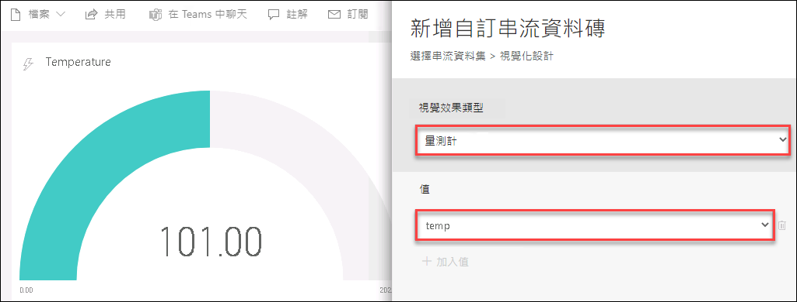
    
    > **注意**：  如果未列出 **temp**，請檢查是否正在執行 IoT Simulator 應用程式，而且串流分析作業也在執行中。此外，您可以停止傳送異常，等到 2 分鐘後，再開始傳送，然後等候 3 至 5 分鐘。接著，重新整理頁面，查看是否有值出現。如果仍未出現，請在 IoT Simulator 應用程式上停用裝置，務必要停止傳送所有遙測/異常，然後將每部裝置取消註冊之後再次註冊，以與裝置重新連線。完成註冊之後，請啟用並開始傳送遙測。
    
1. 若要顯示 [磚詳細資料] 窗格，請按 **[下一步]**。

1. 在 **[磚詳細資料]** 窗格的 **[標題]** 下，輸入 **Temperature** (溫度)。

1. 其餘欄位則維持預設值，然後按一下 **[套用]**。

    如果您看到有關建立手機檢視的通知可予以忽略，該通知很快就會消失 (或自行關閉)。

1. 若要縮小磚的大小，請將滑鼠停留在磚的右下角，然後按一下並拖曳調整大小滑鼠指標。

    盡可能將磚調整至最小。它會調整為不同的預設大小。

1. 若要新增 SpikeAndDipScore 群組橫條圖，請在儀表板頂端，按一下 **[編輯]**，然後選取 **[+ 新增磚]**。

    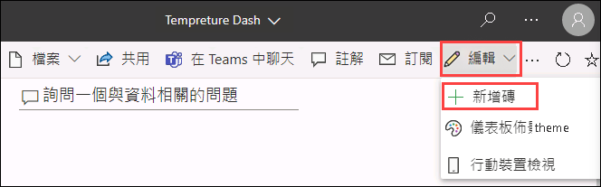

1. 在 **[新增磚]** 窗格的 **[即時資料]** 下，按一下 **[自訂串流資料]**，然後按 **[下一步]**。

1. 在 **[新增自訂串流資料磚]** 窗格的 **[您的資料集]** 下，按一下 **temperaturedataset**，然後按 **[下一步]**。

   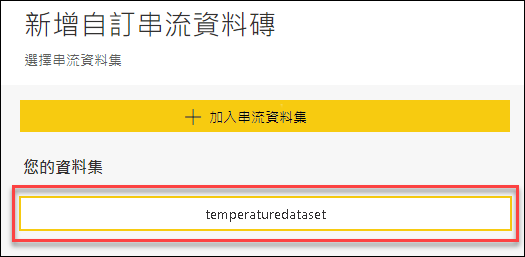

1. 在 **[視覺效果類型]** 下，開啟下拉式清單，然後按一下 **[群組橫條圖]**。

    請注意，變更視覺效果類型時，下面的欄位也會變更。

1. 在 **[值]** 下，按一下 **[+ 加入值]**，開啟下拉式清單，然後按一下 **SpikeAndDipScore**。

   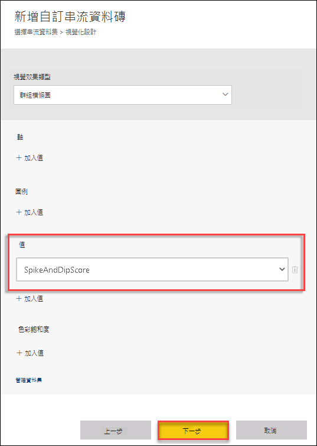

1. 若要顯示 [磚詳細資料] 窗格，請按 **[下一步]**。

1. 在 **[磚詳細資料]** 窗格的 **[標題]** 下，輸入 **SpikeAndDipScore**。

1. 若要關閉 [磚詳細資料] 窗格，請按一下 **[套用]**。

    如果您看到有關建立手機檢視的通知可予以忽略，該通知很快就會消失 (或自行關閉)。

1. 再次調整磚的大小，盡可能縮至最小。

1. 若要新增 IsSpikeAndDipAnomaly 卡片視覺效果，請在儀表板頂端，按一下 **[編輯]**，然後選取 **[+ 新增磚]**。

1. 在 **[新增磚]** 窗格的 **[即時資料]** 下，按一下 **[自訂串流資料]**，然後按 **[下一步]**。

1. 在 **[新增自訂串流資料磚]** 窗格的 **[您的資料集]** 下，按一下 **temperaturedataset**，然後按 **[下一步]**。

1. 在 **[視覺效果類型]** 下，開啟下拉式清單，然後按一下 **[卡片]**。

1. 在 **[欄位]** 下，按一下 **[+ 加入值]**，開啟下拉式清單，然後按一下 **IsSpikeAndDipAnomaly**。

1. 若要顯示 [磚詳細資料] 窗格，請按 **[下一步]**。

   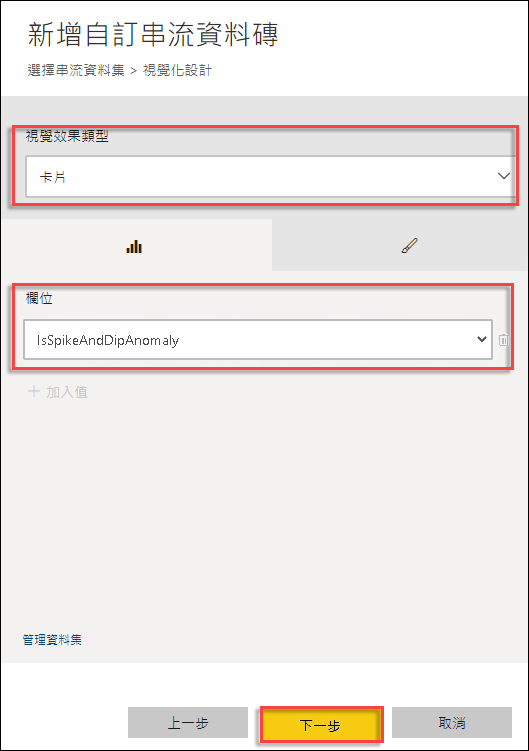

1. 在 **[磚詳細資料]** 窗格的 **[標題]** 下，輸入 **Is Anomaly?** (是否異常?)。

1. 若要關閉 [磚詳細資料] 窗格，請按一下 **[套用]**。

    如果您看到有關建立手機檢視的通知可予以忽略，該通知很快就會消失 (或自行關閉)。

1. 再次調整磚的大小，盡可能縮至最小。

1. 使用拖放動作，依照下列順序，在儀表板左側垂直排列這些磚：

    * SpikeAndDipScore
    * Is Anomaly? (是否異常?)
    * Temperature (溫度)

1. 在儀表板頂端，按一下 **[編輯]**，然後選取 **[+ 新增磚]**。

1. 在 **[新增磚]** 窗格的 **[即時資料]** 下，按一下 **[自訂串流資料]**，然後按 **[下一步]**。

1. 在 **[新增自訂串流資料磚]** 窗格的 **[您的資料集]** 下，按一下 **temperaturedataset**，然後按 **[下一步]**。

    窗格會重新整理，以讓您選擇視覺效果類型與欄位。

1. 在 **[視覺效果類型]** 下，開啟下拉式清單，然後按一下 **[群組橫條圖]**。

    請注意，變更視覺效果類型時，下面的欄位也會變更。

1. 在 **[軸]** 下，按一下 **[+ 加入值]**，然後從下拉式清單中選取 **time**。

1. 在 **[值]** 下，按一下 **[+ 加入值]**，然後從下拉式清單中選取 **IsSpikeAndDipAnomaly**。

1. 在 **[上一個]** 右側的 **[要顯示的時間範圍]** 下，開啟下拉式清單，然後按一下 **5**。

    維持將單位設定為 **[分鐘]**。

1. 若要顯示 [磚詳細資料] 窗格，請按 **[下一步]**。

   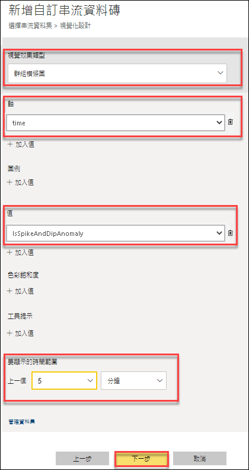

1. 在 **[磚詳細資料]** 窗格的 **[標題]** 下，輸入**過去一小時的異常**。

1. 若要關閉 [磚詳細資料] 窗格，請按一下 **[套用]**。

    如果您看到有關建立手機檢視的通知可予以忽略，該通知很快就會消失 (或自行關閉)。

1. 這一次，延展高度以和左側的 3 個磚一樣高，並配合其餘的儀表板空間延展寬度。

    由於路由與連線數量很多，而會有延遲，但您應可開始在視覺效果中看到發電機溫度資料。

1. 確認您是否正在執行 IoT Simulator 應用程式，而且分析工作也在執行中。

1. 在 **IoT Simulator 應用程式**中，開始傳送 turbine-01 的異常，持續 2 至 3 分鐘後，予以停止。

1. 讓工作至少持續執行 3 至 5 分鐘，再讓 ML 模型開始運作，以在您設定的 Power BI 儀表板中檢視波動。
    
1. 現在您應可看到類似這個作用中的 Power BI 儀表板。

   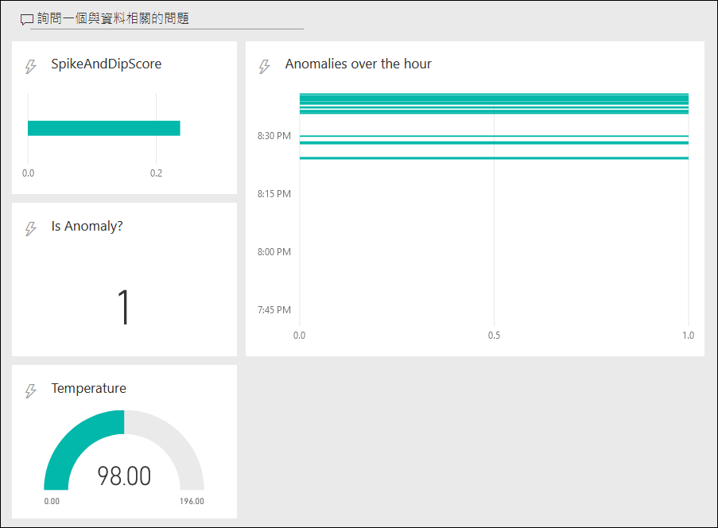

   > **注意**：請務必**停止**串流分析作業，並瀏覽到 IoT Simulator 應用程式。然後按一下 **[停止異常]**，再按一下 **[停止遙測]** 按鈕，為每部裝置停止傳送遙測串流。

### 工作 4：當偵測到異常時收到警示 [唯讀]

**** 
**因為提供的實驗室環境沒有完成這項工作所需的 D365 授權，所以這項工作會以唯讀方式進行**。
****

在此工作中，您會設定要由**服務匯流排佇列**觸發的**邏輯應用程式**，以及在 Dynamics 365 中新增一筆記錄。如果裝置的平均溫度超過特定值，此資料隨即會從串流分析傳送至服務匯流排佇列。

1. 瀏覽到您的資源群組 **iot-{deploymentid}**，然後選取邏輯應用程式 **iot-logicapp-{deployment-id}**。

1. 從邏輯應用程式設計工具窗格中，選取 **[空白邏輯應用程式 +]** 磚。

1. 在搜尋方塊中，輸入 **"azure service bus"** (azure 服務匯流排) 作為篩選條件。從觸發程序清單中，選取觸發 **[一或多封訊息送達佇列時 (自動完成)]** 觸發程序。

   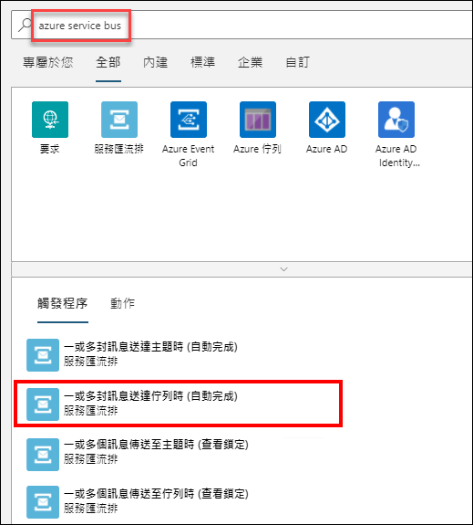
   
1. 當邏輯應用程式設計工具提示您提供連線資訊時，請依照下列步驟進行。

   * 為您的連線提供名稱，例如 **iotservicebusconnection**。
   * 選取您的 **[服務匯流排命名空間]**。
   * 選取服務匯流排原則，然後選取 **[建立]**。

1. 選取傳訊實體 **iotqueue**。
    
1. 為選取的觸發程序提供必要資訊。若要對此動作新增其他可用屬性，請開啟 [新增參數] 清單，然後選取想要的屬性。例如，選取檢查佇列的輪詢間隔與頻率。

1. 在您想要新增動作的步驟下，選取 **[+ 新增步驟]**。

1. 輸入**資料作業**，然後從功能表中加以選取。接著，選取 **[剖析 JSON]** 動作。

1. 選取內容欄位，並提供下列運算式：
   **decodeBase64(Body()?[‘Content’])**
   
1. 按一下 **[請使用範例承載產生結構描述]**，然後貼上下列 JSON 範例承載。    

   **{"AverageTemperature":90,"id":"turbine-01"}**
   
1. 按一下命令列上的 **[儲存]**。

  > 注意：在下個步驟中，您即將新增邏輯應用程式的 Dynamics 365 連接器，其為 Common Data Service。

1. 按一下處理序上的 **[+ 新增步驟]**，然後輸入 **Common Data Service**，選取 **[Common Data Service]**，然後選取 **[建立新記錄]** 動作。

   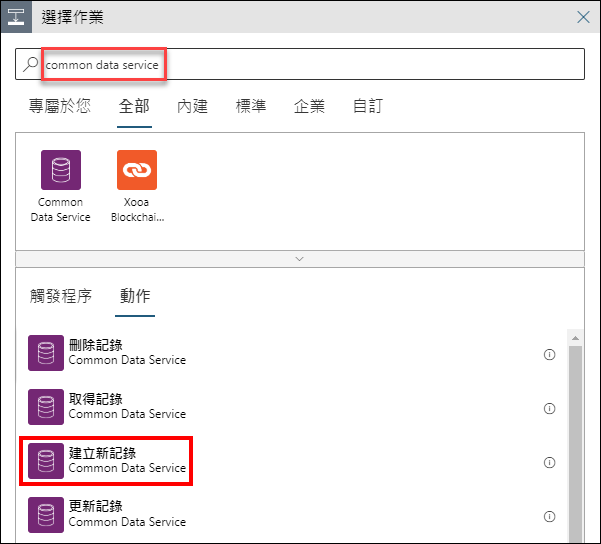

   **注意**：使用 CloudLabs 提供的認證，無法執行其餘的步驟，但可以瀏覽其餘的步驟來了解如何設定警示。

1. 按一下 **[登入]**，以與 Common Data Service 建立連線。

   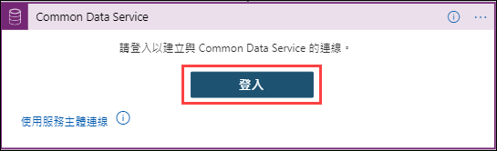

1. 從下拉式清單中，選取您的 **[環境]** 與實體 **[Tasks (工作)]**。

   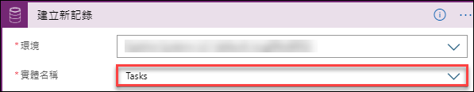
   
1. 現在，按一下區段底部的 **[Add new parameter (新增參數)]**，然後選取 [Record Created On (記錄建立時間)]。

1. 在 **[Subject (主旨)]** 欄位中，提供 **Alert - Device {Dynamic Content id } at { Expression utcNow() }**。對於動態內容與運算式，您需要根據運算式中的剖析 JSON 和 utcNow() 函數，為可用動態內容的識別碼選擇值。

   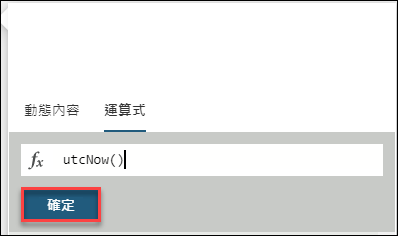

1. 在 **[Description (描述)]** 欄位中，輸入下列訊息內容：

    ```text
     Alert - Average Temperature for Device  @{Dynamic Content['id']} is  @{Dynamic Content['AverageTemperature']}
    ```

1. 接著，對 [Record Created On (記錄建立時間)] 欄位新增 Dynamics 運算式 utcNow()。

   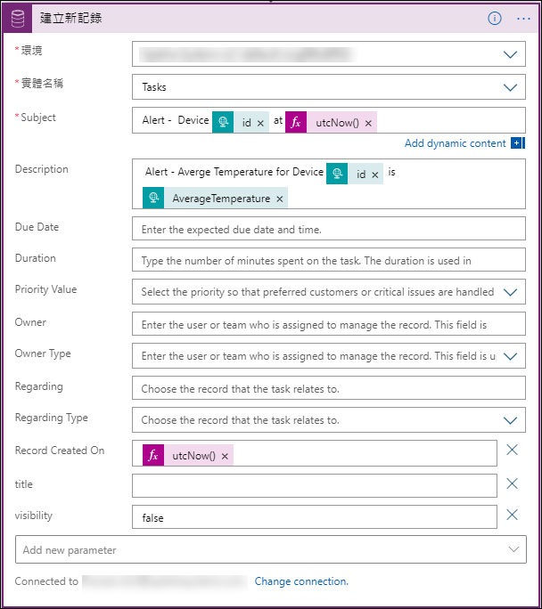
    
1. 正確設定邏輯應用程式後，一旦觸發時，便可在 Dynamics 365 工作中看到項目。

    > **注意**：  請探索一下邏輯應用程式設計工具，然後不必**儲存**變更，即可繼續下一個練習。
    
您已在此練習中了解如何使用內建機器學習模型來分析來自發電機裝置的資料，以及如何在 Power BI 儀表板中將偵測到的異常視覺化。您也了解如何使用服務匯流排觸發程序，在 D365 中使用邏輯應用程式新增警示票證。
