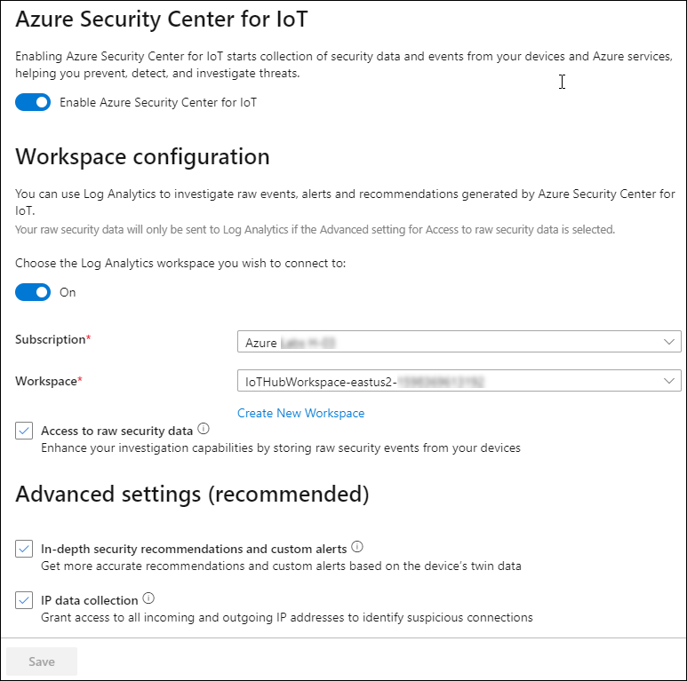
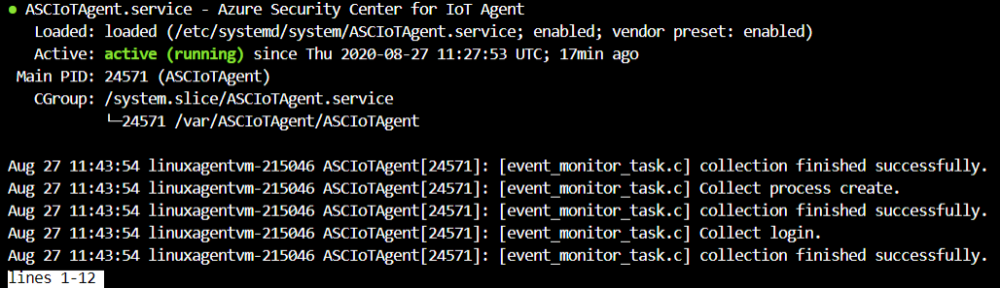

# 練習 5：保護 IoT	

## 案例

IoT 解決方案推出時，CTO 擔心整體安全性，特別是 STRIDE 威脅 (使用者身分識別詐騙、竄改、否認性、資訊洩漏、阻斷服務、權限提升)。

該如何確保解決方案的端對端安全呢？


## 概觀

在此練習中，您會完成下列各項活動：

* 啟用適用於 IoT 的 Azure 資訊安全中心
* 建立安全性模組對應項
* 在 Linux 機器上安裝資訊安全中心代理程式
* 設定受監視的資源
* 建立自訂警示
* 檢閱 Azure 資訊安全中心中的警示

## 指示

### 工作 1：啟用適用於 IoT 中樞的 Azure 資訊安全中心

適用於 IoT 的 Azure 資訊安全中心可讓您統一安全性管理，並在混合式雲端工作負載間與 Azure IoT 解決方案啟用端對端威脅偵測與分析。您可以透過下列連結，深入了解適用於 IoT 的 Azure 資訊安全中心：```https://docs.microsoft.com/en-us/azure/asc-for-iot/overview``` 

適用於 IoT 的 Azure 資訊安全中心可與現有的 IoT 裝置管理平台完全整合，讓您管理裝置安全性狀態，以及使用現有的裝置控制功能。


在此工作中，您會為 IoT 中樞啟用**適用於 IoT 的 Azure 資訊安全中心**。 

1. 在資源群組磚上，按一下 **iot-{deployment-id}**，然後選取現有 IoT 中樞名稱 **iothub-{deployment-id}**。

1. 在左側功能表的 **[安全性]** 下，按一下 **[概觀]**。

    適用於 IoT 中樞的 Azure 資訊安全中心會第一次上線，隨即開啟 [安全性] 窗格。 

1. 如果顯示 **[Secure your IoT solution (保護您的 IoT 解決方案)]** 按鈕，請按一下 **[Secure your IoT solution (保護您的 IoT 解決方案)]**，然後在看到提示時，重新整理視窗。

   

1. 請登出，然後再次登入至 ```https://portal.azure.com```，以讓變更生效。

   > **注意**：您可以忽略在登出前有關權限不足的警告，因為權限會在您再次登入時傳播。

1. 瀏覽回到 IoT 中樞，然後在左側功能表的 **[安全性]** 下，選取 **[概觀]**。

1. 請花一點時間檢閱 **[安全性概觀]** 窗格上的內容。

    > **注意**：適用於 IoT 的 Azure 資訊安全中心剛上線時，並不會立即偵測到威脅，您會在此實驗室結束之前，開始在此 [概觀] 窗格上看到回報的威脅偵測。 

#### 建立 Log Analytics

適用於 IoT 的 Azure 資訊安全中心開啟時，隨即會建立預設的 Azure Log Analytics 工作區，以儲存 IoT 裝置、IoT Edge 和 IoT 中樞的原始安全性事件、警示及建議。

Log Analytics 工作區是可供 Azure 監視器記錄資料使用的唯一環境。每個工作區都有自己的資料存放庫與設定，以及設定資料來源與解決方案將其資料儲存在特定的工作區。您需要 Azure Log Analytics 以供資訊安全中心用來儲存其資料。

在此工作中，您會為 Azure 資訊安全中心建立 Log Analytics 工作區。

1. 開啟 IoT 中樞的 [安全性概觀] 窗格。

1. 在左側功能表的 **[安全性]** 下，按一下 **[設定]**，以顯示安全性設定。 

    現在應會開啟 **[設定]** 頁面刀鋒視窗，**[名稱]** 下會顯示 **[資料集合]** 選項。
    
1. 選取 **[資料集合]**，然後花一分鐘的時間檢閱顯示的 [設定] 資訊。
   
   

    > **注意**：請注意已經為 Log Analytics 工作區定義的 **[Workspace configuration (工作區設定)]**。根據預設，開啟適用於 IoT 的 Azure 資訊安全中心解決方案，即會自動保護您的 Azure 訂用帳戶下的所有 IoT 中樞。需要一些時間才會看到 Log Analytics 工作區。

1. 如果尚未設定 Log Analytics 工作區，請在 **[Workspace configuration (工作區設定)]** 下，按一下 **[Create New Workspace (建立新工作區)]**。

1. 在 **[Log Analytics 工作區]** 窗格中，提供像 **iotworkspace-{deployment-id}** 這樣的唯一名稱，其餘則維持預設值，然後按一下 **[確定]**。

1. 部署成功之後，從 **[工作區]** 的下拉式清單中選取您剛才建立的工作區。

1. 按一下 **[儲存]** 以儲存資料集合設定。

### 工作 2：建立安全性模組對應項

裝置對應項是 JSON 文件，而文件中儲存裝置狀態資訊，包括中繼資料、設定及條件。與 IoT 中樞連線的每部裝置，Azure IoT 中樞都會為其維護裝置對應項。如需有關裝置對應項的詳細資訊，請參閱下文 - ```https://docs.microsoft.com/en-us/azure/iot-hub/iot-hub-devguide-device-twins```

和裝置對應項類似，模組對應項也是 JSON 文件，而文件中儲存模組狀態資訊，包括中繼資料、設定及條件。與 IoT 中樞連線的每個模組，Azure IoT 中樞都會為其維護模組對應項。如需有關模組對應項的詳細資訊，請參閱下文 - ```https://docs.microsoft.com/en-us/azure/iot-hub/iot-hub-devguide-module-twins```

適用於 IoT 的 Azure 資訊安全中心利用模組對應項機制，並會為您的每部裝置維護稱為 "azureiotsecurity” 安全性模組對應項。安全性模組對應項包含每一部裝置的所有裝置安全性相關資訊。為了充分利用適用於 IoT 的 Azure 資訊安全中心的功能，您需要為新的 IoT Edge 裝置建立、設定和使用這些安全性模組對應項。

安全性模組對應項包含每一部裝置的所有裝置安全性相關資訊。

請使用下列任何一種方法來建立安全性模組對應項 (**azureiotsecurity**)：

* 使用模組批次指令碼 (```https://github.com/Azure/Azure-IoT-Security/tree/master/security_module_twin```)。此指令碼會使用預設的設定，為新裝置 (或沒有模組對應項的裝置) 自動建立模組對應項。

* 使用每部裝置的特定設定，個別地手動編輯每個模組對應項。

在此工作中，您會手動建立安全性模組對應項。

1. 請瀏覽到資源群組磚上，按一下 **iot-{deployment-id}**，然後選取 IoT 中樞名稱 **iothub-{deployment id}**。

1. 從左側功能表的 **[總管]** 下，按一下 **[IoT 裝置]**。

1. 在 **[裝置識別碼]** 下，按一下 **turbine-01**。

1. 在 **turbine-01** 刀鋒視窗靠近頂端處，按一下 **[+ 新增模組身分識別]**。

1. 在 **[新增模組身分識別]** 窗格的 **[模組身分識別名稱]** 下，輸入 **azureiotsecurity**

    您會使用對稱金鑰進行驗證，因此可讓所有欄位維持其預設值。

1. 在窗格底部，按一下 **[儲存]**。

1. 在 **turbine-01** 刀鋒視窗的 **[模組身分識別]** 下，現在應會看到列出您的 **azureiotsecurity** 裝置。

    請注意，連接狀態為 **[Disconnected (已中斷連線)]**。
    
    

    > **重要**：模組身分識別一定要稱為 **azureiotsecurity**，不可為其他唯一名稱。

1. 在 **turbine-01** 刀鋒視窗上，按一下 **[主索引鍵]** 右側的 **[複製]**，然後儲存該值，以供稍候使用。

    > **注意**：請務必複製裝置的**主索引鍵**，而不是連接字串。

    

1. 瀏覽回到 [IoT 中樞] 刀鋒視窗。

1. 在左側功能表上，按一下 **[概觀]**。

1. 在靠近刀鋒視窗頂端的 [基本資訊] 區域中，按一下 **[主機名稱]** 右側的 **[複製到剪貼簿]**，然後儲存該值，以供稍候使用。

    > **注意**：IoT 中樞主機名稱看起來和下面類似：iothub-2144XX.azure-devices.net

### 工作 3：部署適用於 IoT 的 Azure 資訊安全中心安全性代理程式

適用於 IoT 的 Azure 資訊安全中心安全性代理程式會從 IoT 裝置收集資料，並執行安全性動作以緩解偵測到的弱點。您可以使用一組自訂的模組對應項屬性來控制安全性代理程式設定。一般而言，這些屬性的次要更新並不常見。

有 C 與 C# 代理程式。每種適用於 IoT 的 Azure 資訊安全中心的安全性代理程式變體都提供相同的功能組合，並支援類似的設定選項。

若為裝置資源有限或最少的裝置，建議使用 C 代理程式。

在此工作中，您會將安全性代理程式部署至模擬的裝置。 

#### 登入 Linux VM

1. 從 Azure 首頁選取資源群組，然後從清單中選取 **linuxagentvm-{deployment-id}** Linux VM 資源，以在 Azure 入口網站中瀏覽回到 Linux 機器 **linuxagentvm-{deployment-id}**。

1. 在刀鋒視窗頂端，按一下 **[連線]**，然後按一下 **[SSH]**。

1. 使用範例 SSH 命令，建立可連線至 VM 的命令。

   將範例命令複製到文字編輯器，然後從命令中移除 `-i <私密金鑰路徑>。留下的命令格式應如下所示：

    ```cmd\sh
    ssh <admin user>@<ip address>
    ```

    您的命令看起來應類似於：`ssh demouser@52.170.205.79`。

1. 在 Azure 入口網站工具列上，按一下 **[Cloud Shell]**。

    確定已在 [Cloud Shell] 內選取 **[Bash]** 環境。

1. 在 Cloud Shell 命令提示字元，貼上您在上面建立的 `ssh` 命令，然後按 **Enter**。

1. 看到 **[Are you sure you want to continue connecting? (您要繼續連線嗎?)]** 的提示時，輸入 **yes**，然後按 **Enter**。

    由於使用自我簽署的憑証來保護與 VM 連線，所以這是安全性確認提示。此提示的回答會記錄下來，用於後續連線，您只會在第一次連線時看到提示。

1. 提示您輸入密碼時，請輸入 **Password.1!!**。

    請注意，連線之後，終端機命令提是字元會變成顯示 Linux VM 的名稱，看起來和下面類似。

    ```cmd/sh
    demouser@linuxagentvm-{your-id}:~$
    ```

    這可協助您持續追蹤所連線的 VM 和目前的使用者。

#### 將對稱金鑰新增至裝置

您可以透過安全性代理程式來連線至 IoT 中樞。若要實作連線，您需要裝置的對稱金鑰或憑證資訊。

在此實驗室中，您即將使用對稱金鑰作為驗證方式，並需要儲存在裝置上的暫存文字文件中。

1. 請確認您的 **turbine-01** IoT 裝置有可用的**主要金鑰**值。

   > **注意**：您之前應該已在此實驗室中儲存主要金鑰。如果沒有，請完成下列動作：

    1. 瀏覽到資源群組，然後選取 IoT 中樞名稱 **iothub-{deployment-id}**
    1. 在左側功能表的 **[總管]** 下，按一下 **[IoT 裝置]**。
    1. 在 **[裝置識別碼]** 下，按一下 **turbine-01**。
    1. 從詳細資料清單中複製您的**主要金鑰**。
    1. 返回 Azure Cloud Shell - 您應該仍與 **linuxagentvm-{deployment-id}** 虛擬機器連線。

1. 在 Cloud Shell 命令提示字元輸入下列命令：

    ```cmd/sh
    echo "<primary_key>" > s.key
    ```

    此命令會使用 **turbine-01** 裝置的**主要金鑰**，建立裝置驗證類型檔案。

    > **注意**：若要檢查您是否將正確的主要金鑰加入至檔案，請使用 `nano s.key` 命令來開啟您的檔案。檢查您裝置的**主要金鑰**是否已在檔案中。若要結束 nano 編輯器，請按住 `Ctrl`，再按 `X`。按住 `Shift`，再按 `Y` 來儲存檔案，然後按 Enter。

#### 安裝安全性代理程式

1. 透過 SSH，確定 Cloud Shell 工作階段仍與 VM 連線。

1. 在 Cloud Shell 命令提示字元加以自訂，然後輸入下列命令： 

    您需要以驗證參數來取代預留位置值。

    ```bash
    cd /var/ASCIoTAgent
    sudo ./InstallSecurityAgent.sh -i -aui Device -aum SymmetricKey -f <Insert file location of your s.key file> -hn <Insert your full IoT Hub host name> -di <Device name>
    ```

    以下是命令看起來應有的格式範例：

    ```bash
    sudo ./InstallSecurityAgent.sh -i -aui Device -aum SymmetricKey -f /home/demouser/s.key -hn iothub-214XXX.azure-devices.net -di turbine-01`
    ```

    > **注意**：務必要指定您的 IoT 中樞主機名稱，而不是這裡所列出的名稱。 
    > 使用 pwd 命令來找到檔案位置。
   
    > **重要**：
    > 務必要使用完整的 IoT 中樞主機名稱 - 也就是說，`-hn` 參數值為 **iothub-{deployment-id}.azure-devices.net**。

    此指令碼會執行下列函數：

    * 安裝必要條件。
    * 新增服務使用者 (互動式登入處於停用)。
    * 將代理程式安裝為精靈 - 假設裝置使用 **systemd** 進行服務管理。
    * 設定 **sudo 使用者**，允許代理程式以根目錄執行特定工作。
    * 以提供的驗證參數設定代理程式。

1. 觀看 Cloud Shell 終端機中的輸出來觀察命令執行進度。
   
1. 若要檢查適用於 IoT 的 Azure 資訊安全中心代理程式的部署狀態，請在 Cloud Shell 命令提示字元輸入下列命令。： 

    ```cmd/sh
    systemctl status ASCIoTAgent.service
    ```

    您應會看到和下面類似的輸出：

    

    特別是，您應要確認服務為 **Loaded: loaded** 與 **Active: active (running)**。如果狀態不是 running，您可以執行命令 "sudo reboot “，重新啟動虛擬機器並連回 VM，然後檢查服務是否為使用中。

1. 在資源群組磚上，瀏覽到 **iot-{deployment-id}**，然後選取現有 IoT 中樞名稱 **iothub-{deployment-id}**。

    開啟 [IoT 中樞] 刀鋒視窗，在導覽功能表的 **[總管]** 下，按一下 **[IoT 裝置]**，然後按一下 **turbine-01**。

1. 請注意，在 **[模組身分識別]** 下的 **azureiotsecurity** 模組，現在處於 **[Connected (已連線)]** 狀態，

    

現在，裝置上已安裝適用於 IoT 的 Azure 資訊安全中心裝置代理程式，該代理程式能夠從裝置收集、彙總和分析原始安全性事件。

### 工作 4：設定適用於 IoT 的 Azure 資訊安全中心

使用適用於 IoT 的 Azure 資訊安全中心，一個儀表板便可監視整個 IoT 解決方案，呈現 Azure 中的所有 IoT 裝置、IoT 平台及後端資源。

在 IoT 中樞上啟用適用於 IoT 的 Azure 資訊安全中心之後，它即可自動識別與 IoT 中樞連線和與 IoT 解決方案相關的其他 Azure 服務。

除了自動關聯性偵測，您也可以挑選其他 Azure 資源群組，標記為 IoT 解決方案一部分。選取項目允許新增整個訂用帳戶、資源群組或單一資源。

#### 開啟 IoT 中樞

1. 在瀏覽器中，開啟 Azure 入口網站，然後瀏覽到您的 IoT 中樞。

1. 在左側功能表的 **[安全性]** 下，按一下 **[設定]**。

1. 從 **[設定]** 頁面的 **[名稱]** 下，選取 **[受監視的資源]**。

1. 在窗格頂端，按一下 **[編輯]**。

    **[解決方案管理]** 窗格隨即開啟，您可以在這裡選取其他 Azure 資源群組，將當中的資源連線至您的安全性解決方案。

1. 在 **[訂用帳戶]** 下，選取您擁有存取權的訂用帳戶。

1. 在 **[資源群組]** 下拉式清單中，按一下 **iot-{deployment-id}**。

1. 在 **[解決方案管理]** 窗格底部，按一下 **[套用]**。

    如果無法使用 **[套用]** 按鈕，別擔心，已經新增該資源。

1. 關閉 **[解決方案管理]** 窗格與 **[資源]** 刀鋒視窗，然後瀏覽回到 IoT 中樞概觀頁面。

定義所有資源關聯性之後，適用於 IoT 的 Azure 資訊安全中心會利用 Azure 資訊安全中心，為您提供這些資源的安全性建議與警示。

#### 檢視適用於 IoT 的 Azure 資訊安全中心運作

您現在已於裝置上安裝安全性代理程式，也完成設定解決方案。可以趁機查看適用於 IoT 的 Azure 資訊安全中心的不同檢視。

1. 在左側功能表的 **[安全性]** 下，按一下 **[概觀]**。 

    您會看到兩個圖表上呈現裝置、中樞及其他資源的健康狀態概觀。當您開啟 Azure IoT 資訊安全中心時，隨即可以看到啟用的內建即時監視、建議和警示。

    下圖顯示完成執行安全性評估之後的儀表板狀態。
    
    

    > **重要**：
    > 為您的 IoT 資源評估安全性設定的程序可能需要花費 24 小時的時間執行，因此儀表板上顯示的初始狀態並未反映資源的實際狀態。 
    
### 工作 5：自訂警示簡介

使用自訂安全性群組與警示，以充分利用整個 IoT 解決方案的端對端安全性資訊與類別目錄裝置知識。這樣做可協助您為解決方案提供更嚴密的安全性。 

適用於 IoT 的 Azure 資訊安全中心可讓您將這項瞭解轉譯裝置行為原則，並針對任何偏離所預期正常行為的情況發出警示。

#### 自訂警示

如上所述，如果客戶瞭解其解決方案所需的特定行為，可以設定在行為超乎預期時觸發自訂警示。在此練習中，您會建立自訂警示，監視透過 **MQTT** 通訊協定傳送的**裝置到雲端**訊息。

1. 開啟 **IoT Simulator 應用程式**，然後開始傳送裝置的遙測資料。

1. 在 Azure 入口網站上，瀏覽到 [IoT 中樞] 刀鋒視窗。

1. 在左側功能表的 **[安全性]** 下，按一下 **[設定]**。

1. 在出現的 **[設定]** 頁面窗格中，選取 **[名稱]** 下的 **[自訂警示]**。

1. 花一點時間檢查 **[自訂警示]** 窗格。

    乍看之下，這似乎是空白窗格，但列在 **[名稱]** 下的項目，實際上就是為您自動建立的**預設**安全性群組。

    安全性群組可讓您定義裝置的邏輯群組，並以集中方式管理其安全性狀態。這些群組代表配備特定硬體的裝置、於特定位置部署的裝置，或任何適合您特定需求的其他群組。

1. 若要將自訂警示新增至預設安全性群組，請按一下 **[預設]**。

    **[裝置安全性群組]** 刀鋒視窗隨即列出所有作用中的自訂警示。由於您是第一次到此，因此該刀鋒視窗是空白的。

1. 在刀鋒視窗頂端，按一下 **[建立自訂警示規則]**。

    **[建立自訂警示規則]** 窗格隨即開啟。請注意，**[裝置安全性群組]** 欄位已填入 **[預設]** 群組。

1. 在 **[自訂警示]** 下拉式清單中，按一下 **[裝置到雲端訊息數 (MQTT 通訊協定) 不在允許的範圍內]**。

    > **提示**：
    > 檢閱許多可用的自訂警示。考慮該如何用來保護您的解決方案。

    > **注意**：
    > **[描述]** 與 **[必要屬性]** 會根據選擇的 **[自訂警示]** 而變更。

1. 在 **[必要屬性]** 下的 **[最小閾值]** 欄位中，輸入 **1**。

    此設定預期在 5 分鐘的期間內，應至少傳送一則訊息。

1. 在 **[最大閾值]** 下，輸入 **5**。

    此設定預期在 5 分鐘的期間內，不應傳送超過五則訊息。

1. 在 **[時段大小]** 下拉式清單中，按一下 **00:05:00**。

1. 在 **[建立自訂警示規則]** 窗格底部，按一下 **[確定]**。

1. 在 **[預設]** (裝置安全性群組) 刀鋒視窗，按一下 **[儲存]**。

    如不儲存新的警示，當您下次關閉 IoT 中樞時，就會刪除該警示。您會隨即返回自訂警示清單。 
    
### 工作 6：IoT 裝置與裝置對應項

#### 設定 IoT 裝置與裝置對應項

> *裝置對應項*是 JSON 文件，而文件中儲存裝置狀態資訊，包括中繼資料、設定及條件。與 IoT 中樞連線的每部裝置，Azure IoT 中樞都會為其維護裝置對應項。

務必先向 IoT 中樞註冊裝置，才能進行連線。

1. 在 Azure 入口網站上，瀏覽到 [IoT 中樞] 刀鋒視窗。

1. 在左側功能表的 **[總管]** 下，按一下 **[IoT 裝置]**。

1. 在 **[IoT 裝置]** 窗格頂端，按一下 **turbine-01**

1. 若要顯示裝置對應項，請按一下 **[裝置對應項]**。

    現有的裝置對應項 JSON 隨即顯示，並和下面類似：

    ```json
    {
        "deviceId": "turbine-01",
        "etag": "AAAAAAAAAAE=",
        "deviceEtag": "Mjg2NzY5NzAw",
        "status": "enabled",
        "statusUpdateTime": "0001-01-01T00:00:00Z",
        "connectionState": "Disconnected",
        "lastActivityTime": "0001-01-01T00:00:00Z",
        "cloudToDeviceMessageCount": 0,
        "authenticationType": "sas",
        "x509Thumbprint": {
            "primaryThumbprint": null,
            "secondaryThumbprint": null
        },
        "version": 2,
        "tags": {
            "SecurityGroup": "default"
        },
        "properties": {
            "desired": {
                "$metadata": {
                    "$lastUpdated": "2020-06-11T13:09:38.4712899Z"
                },
                "$version": 1
            },
            "reported": {
                "$metadata": {
                    "$lastUpdated": "2020-06-11T13:09:38.4712899Z"
                },
                "$version": 1
            }
        },
        "capabilities": {
            "iotEdge": false
        }
    }
    ```

1. 若要將裝置新增至**預設**安全性群組，請在 **version** 與 **properties** 欄位之間插入下列 JSON：

    ```json
    "tags": {
        "SecurityGroup": "default"
    },
    ```

    結果的 JSON 和下面類似：

    ```json
    {
        "deviceId": "turbine-01",
        "etag": "AAAAAAAAAAE=",
        "deviceEtag": "Mjg2NzY5NzAw",
        "status": "enabled",
        "statusUpdateTime": "0001-01-01T00:00:00Z",
        "connectionState": "Disconnected",
        "lastActivityTime": "0001-01-01T00:00:00Z",
        "cloudToDeviceMessageCount": 0,
        "authenticationType": "sas",
        "x509Thumbprint": {
            "primaryThumbprint": null,
            "secondaryThumbprint": null
        },
        "version": 2,
        "tags": {
            "SecurityGroup": "default"
        },
        "properties": {
            "desired": {
                "$metadata": {
                    "$lastUpdated": "2020-06-11T13:09:38.4712899Z"
                },
                "$version": 1
            },
            "reported": {
                "$metadata": {
                    "$lastUpdated": "2020-06-11T13:09:38.4712899Z"
                },
                "$version": 1
            }
        },
        "capabilities": {
            "iotEdge": false
        }
    }
    ```

1. 若要套用更新的 JSON，請按一下 **[儲存]**。

1. 關閉 **[裝置對應項]** 窗格，並將 Azure 入口網站縮至最小。

1. 開啟 **IoT Simulator 應用程式**，然後按一下 **[傳送遙測]** 按鈕，開始傳送遙測資料。

### 工作 7：檢閱資訊安全中心警示

現在，主控台應用程式已經傳送傳送足夠的遙測，可以觸發先前建立的自訂警示。 

> **注意**：該警示設定為在 5 分鐘的時段內，從裝置傳送到雲端的訊息不到 1 則和超過 5 則時才會觸發。

#### 檢閱資訊安全中心儀表板

1. 在 Azure 入口網站上，瀏覽到 [IoT 中樞] 刀鋒視窗。

1. 在左側功能表的 **[安全性]** 下，按一下 **[概觀]**。

    請查看 **[Threat detection (威脅偵測)]** 區段。您應會看到 **[Device security alerts (裝置安全性警示)]** 圖表中顯示一或多個警示：

    

    您應該也會在 **[Devices with the most alerts (警示最多的裝置)]** 磚中，看到 **turbine01** 裝置的項目。

    > **注意**：需要 15 到 20 分鐘之間的時間，儀表板上才會顯示警示。

1. 在 **[Threat detection (威脅偵測)]** 下，按一下 **[Devices with the most alerts (警示最多的裝置)]** 磚。

    這樣會開啟 **[Alerts (警示)]** 刀鋒視窗，如同您在左側功能表的 **[安全性]** 下，按一下 **[安全性警示]** 後所見。

    您隨即會看到安全性警示清單：

    

    最新的警示會以 **[新]** 的標籤標示。

1. 將 Azure 入口網站縮至最小，然後開啟 **IoT Simulator 應用程式**。

1. 按一下 **[停止遙測]** 按鈕，停止傳送遙測資料。


您已在此練習中了解如何保護 IoT解決方案。此實驗室到此結束。 

